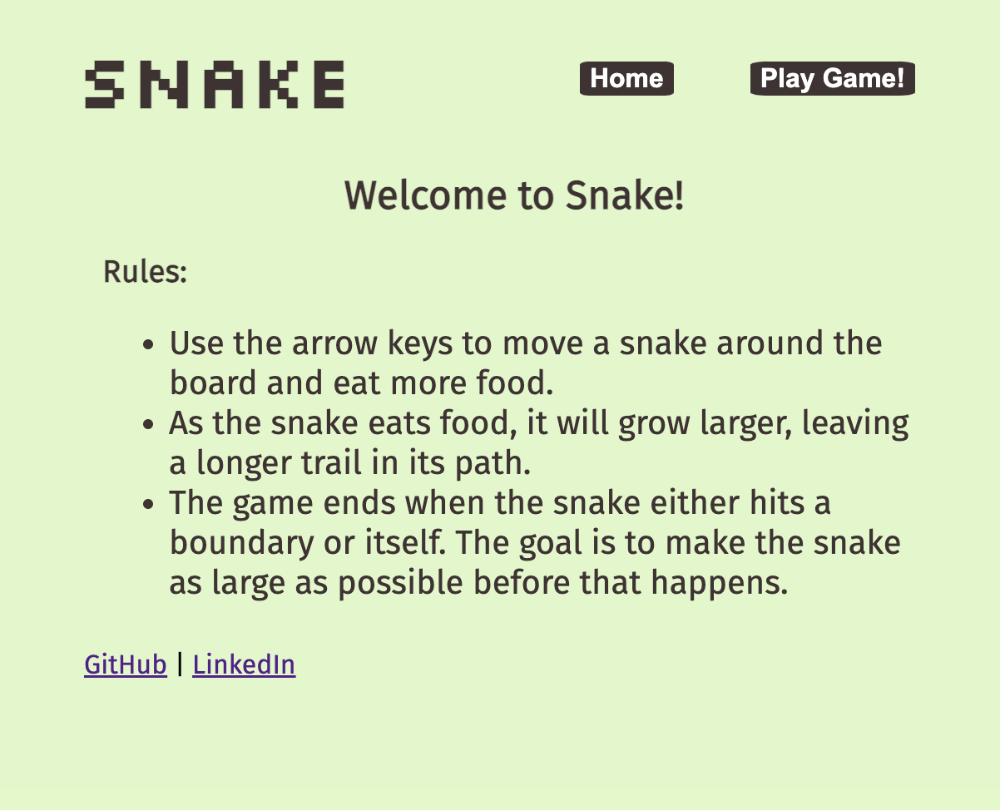
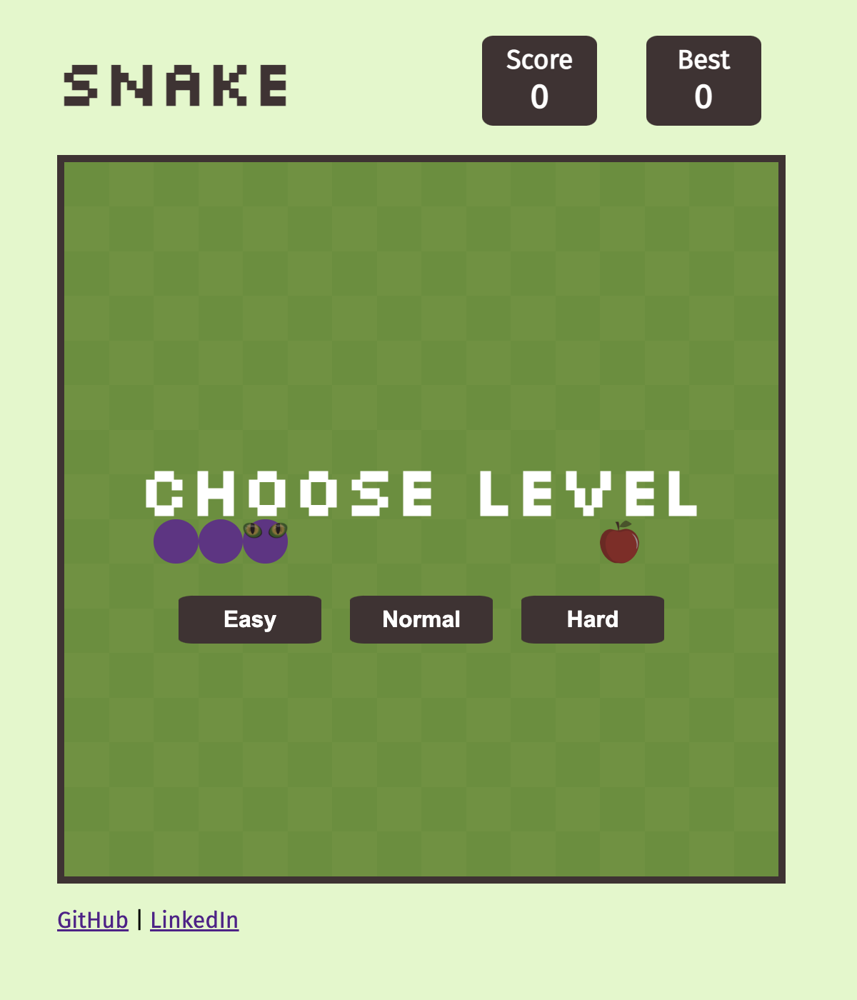
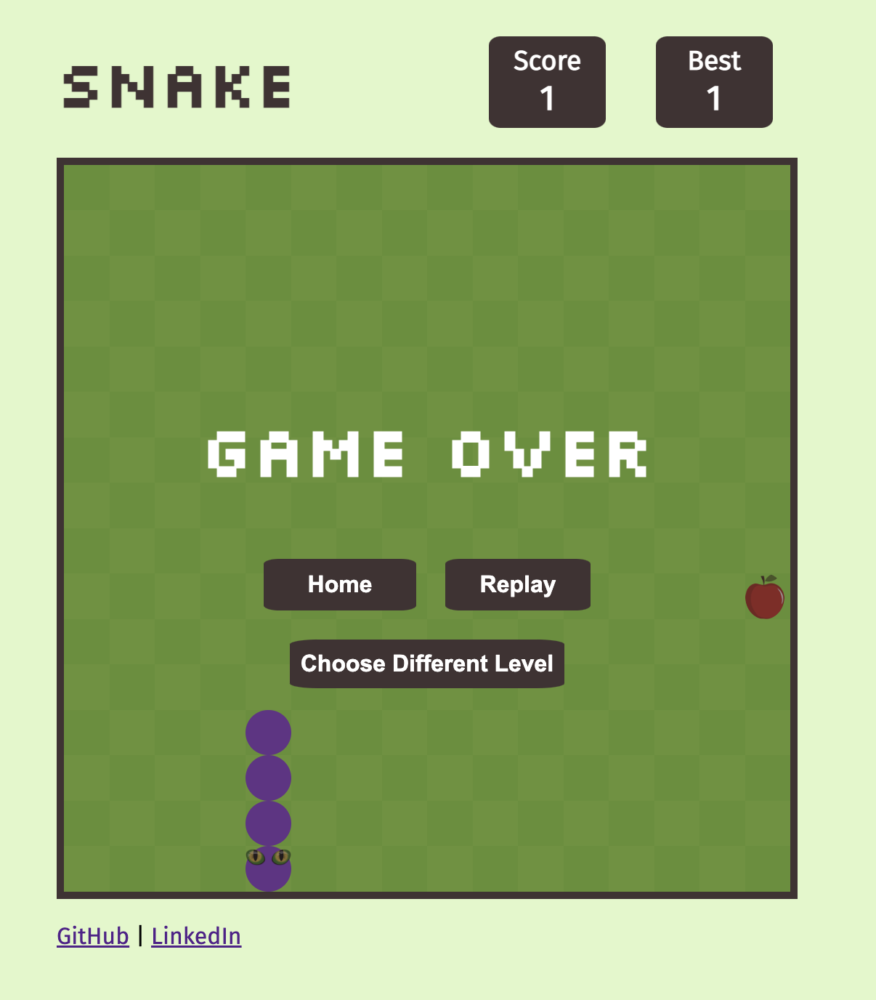

# Snake

## Date: 10/1/2022

### By: Kalen Luciano

#### [GitHub](https://github.com/kalenluciano) | [LinkedIn](https://www.linkedin.com/in/kalen-luciano-52377b15b/)

---

### **_Description_**

This is an in-browser version of the game Snake. In the game, the user controls a "snake" block on a bordered grid and attempts to collect items by running into them with the head of the snake block. As the user collects items, they earn points and the snake grows behind itself, leaving a longer tail in its path. The user loses when the snake runs into the border or itself.

---

### **_Technologies_**

-   HTML
-   CSS
    -   Grid
    -   Flexbox
-   JavaScript
    -   Arrays
        -   .push()
        -   .pop()
        -   .unshift()
        -   .splice()
    -   Loops
        -   for
        -   for of
        -   while
    -   Math
        -   .random()
        -   .floor()
        -   .abs()
    -   DOM
        -   .querySelector()
        -   .querySelectorAll()
        -   .createElement()
        -   .setAttribute()
        -   .classList.add()
        -   .appendChild()
        -   .removeChild()
        -   .hasChildNodes()
    -   Event listeners
        -   ‘click’
        -   ‘keydown’
        -   ‘touchstart’
        -   ‘touchend’
    -   Switch statements
    -   setInterval()
    -   clearInterval()

---

### **_Getting Started_**

The project itself was deployed and can be viewed [here](https://snake-video-game.surge.sh/).

-   Use the left or right arrow to move horizontally.
-   Use the up or down arrow to move vertically.
-   Collect items by running into them with the head of the snake.
-   Avoid running into the snake's tail or into the boundary.

---

### **_Screenshots_**

#### Landing Page

#### Initial Game Play

#### Game Play

#### Game Over

---

### **_Future Updates_**

-   [ ] Add dark mode feature
-   [ ] Make sounds when the snake collects an item or hits a boundary
-   [ ] Make an animation when the snake hits a boundary
-   [ ] Toggle sound on and off
-   [ ] Disable webpage scroll on mobile display

---

### **_Credits_**

A [Trello board](https://trello.com/invite/b/reTJzqZO/ee88493ce0669b57fdd76c8c504e1cde/project-one) was used to keep track of development progress.

This Stack Overflow [article](https://stackoverflow.com/questions/2264072/detect-a-finger-swipe-through-javascript-on-the-iphone-and-android) served as inspiration for the swiping feature available on mobile devices.

Snake eyes image found [here](https://pixabay.com/vectors/vector-eyes-inkscape-eyes-eyes-1639322/).

Apple image found [here](https://pixabay.com/vectors/apple-fruit-red-healthy-diet-4967157/).
